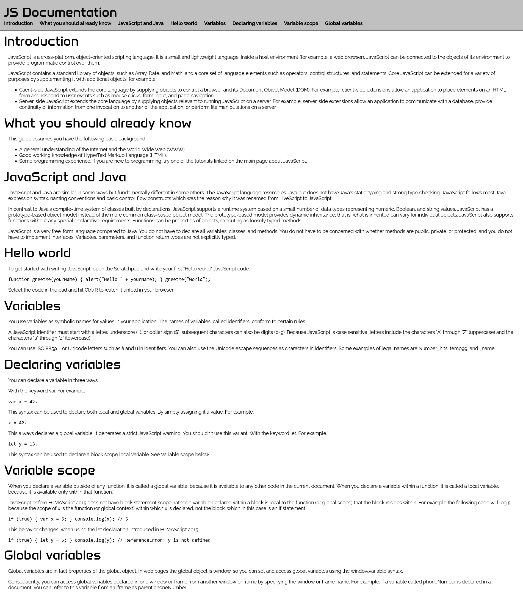

# Technical Documentation Page

This is a responsive technical documentation page created as part of the freeCodeCamp Responsive Web Design Certification. It serves as a structured guide for JavaScript concepts and best practices, with a user-friendly layout designed to enhance readability and navigation.

## Table of contents

- [Technical Documentation Page](#technical-documentation-page)
  - [Table of contents](#table-of-contents)
  - [Overview](#overview)
    - [Screenshot](#screenshot)
    - [Links](#links)
    - [Features](#features)
    - [Built with](#built-with)
    - [What I learned](#what-i-learned)
  - [Author](#author)
  - [Acknowledgments](#acknowledgments)

## Overview

This project allows users to:
- Access comprehensive documentation about JavaScript, including topics like variables, scope, and global variables.
- Navigate seamlessly between sections using a fixed navigation bar.
- Enjoy a responsive design optimized for both desktop and mobile devices.

### Screenshot



### Links

- Live Site URL: [DT Code](https://technical-documentation-page.dtcode.se/)

### Features

- A fixed navigation bar for quick access to different sections of the page that remains visible at all times, enhancing usability and navigation.
- Clean and consistent typography for easy reading.
- Responsive design that adapts to various screen sizes.
- Smooth scrolling with scroll padding for a polished navigation experience.

### Built with

- HTML5 for structure
- CSS3 for styling and layout
  - Google Fonts for custom typography
  - CSS Flexbox for layout organization
  - Media queries for responsive design

### What I learned

Through this project, I gained a better understanding of:
- Building a fixed navigation bar and ensuring its responsiveness.
- Using `scroll-behavior: smooth;` for a seamless user experience when navigating between sections.
- Structuring content in a clean and accessible manner with semantic HTML.
- Writing CSS for responsive layouts using media queries and `scroll-padding-top` for better scrolling behavior on smaller screens.

To enhance navigation, I implemented smooth scrolling and added scroll padding to prevent content from being hidden behind the fixed navigation bar. Here's an example:

```css
html {
  scroll-behavior: smooth; /* Enables smooth scrolling when navigating to anchor links */
  scroll-padding-top: 120px; /* Adds padding to prevent content from being hidden behind the fixed navbar */
}

@media screen and (max-width: 1000px) {
  html {
    scroll-padding-top: 150px; /* Adjusts padding for smaller screens */
  }
}
```

## Author

- GitHub - [@dantvi](https://github.com/dantvi)
- LinkedIn - [@danieltving](https://www.linkedin.com/in/danieltving/)

## Acknowledgments

Special thanks to freeCodeCamp for providing this project as part of their Responsive Web Design Certification.
